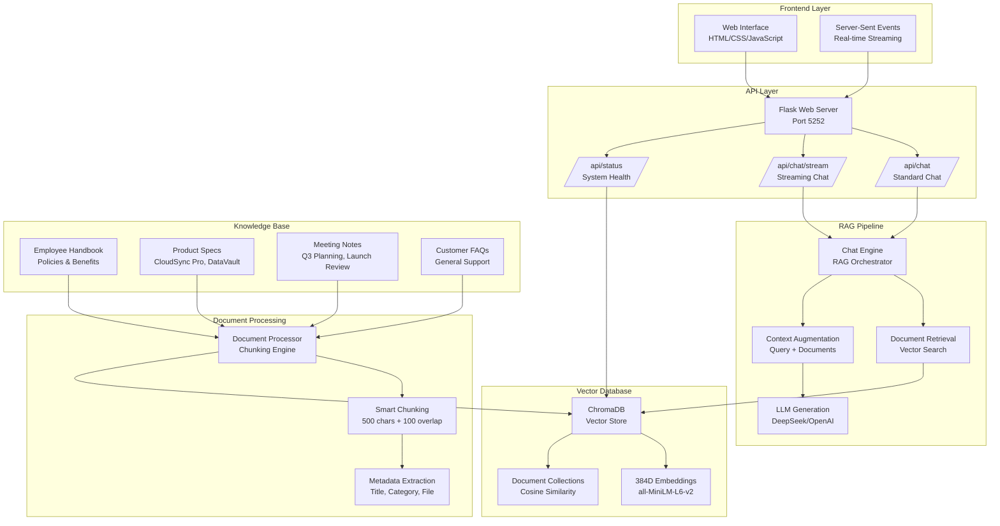
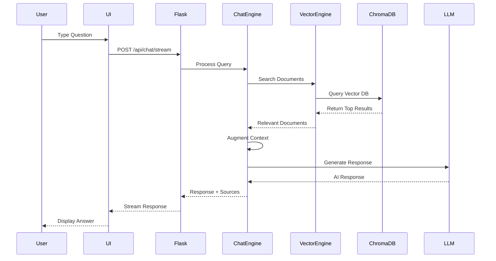
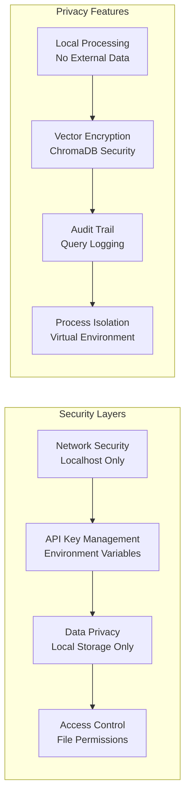

# TechCorp AI - Technical Architecture Diagram

## System Architecture Overview



## Data Flow Diagram



## Component Interaction Details

### 1. Document Ingestion Flow
```
Document Files (.md) → Document Processor → Chunking → Embeddings → ChromaDB
     ↓                    ↓                ↓           ↓           ↓
  Markdown Text    Smart Segmentation  500-char   384D Vector   Persistent
  Content         with 100-char       Chunks     Arrays       Storage
                  Overlap
```

### 2. Query Processing Flow
```
User Question → Vector Encoding → Semantic Search → Top 5 Results → Context Augmentation → LLM Generation → Response
     ↓              ↓              ↓              ↓              ↓              ↓              ↓
  Natural Text   384D Vector   Cosine Distance  Relevant Docs  Enhanced      AI Model      Formatted
  Query         Embedding     Similarity       with Metadata  Prompt        Output        Answer
```

### 3. Response Generation Flow
```
Retrieved Documents → Context Builder → Augmented Prompt → LLM API → Response Parser → Source Attribution → Final Output
         ↓              ↓              ↓              ↓           ↓              ↓              ↓
    Top 5 Results   Document Text   Query + Docs   API Call    Raw Text     Source Links   User Display
    with Scores     + Metadata      + Instructions  Response    Processing   + Confidence   + Sources
```

## Performance Characteristics

### Response Time Breakdown
```
Total Response Time: < 1 second
├── Document Retrieval: ~50ms
├── Context Augmentation: ~10ms
├── LLM API Call: ~200-800ms
├── Response Processing: ~10ms
└── Network Latency: ~50-100ms
```

### Memory Usage
```
System Memory Requirements:
├── Embedding Model: ~90MB
├── ChromaDB Index: ~50-200MB (depends on docs)
├── Flask Application: ~50MB
├── Document Cache: ~10-50MB
└── Total: ~200-400MB typical
```

### Scalability Metrics
```
Document Processing Capacity:
├── Chunk Size: 500 characters
├── Overlap: 100 characters
├── Embedding Dimensions: 384
├── Max Documents: 10,000+ (theoretical)
├── Max Chunks: 100,000+ (theoretical)
└── Search Performance: O(log n) complexity
```

## Security & Privacy Architecture



## Error Handling & Resilience

### Fallback Mechanisms
```
Primary Path: User Query → RAG Pipeline → LLM Response
     ↓
Fallback 1: LLM Unavailable → Context-Based Response
     ↓
Fallback 2: No Context → Generic Response
     ↓
Fallback 3: System Error → User-Friendly Error Message
```

### Error Recovery
```
Error Types & Recovery:
├── API Key Issues: Environment variable validation
├── Model Loading: Offline mode fallback
├── Network Errors: Retry with exponential backoff
├── Memory Issues: Garbage collection and cleanup
└── Database Errors: Connection retry and validation
```

## Monitoring & Observability

### Health Check Endpoints
```
/api/status Response:
{
  "status": "operational",
  "documents": 8,
  "chunks": 45,
  "last_updated": "2024-01-15T10:30:00Z"
}
```

### Performance Metrics
```
Key Performance Indicators:
├── Response Time: Average < 1s
├── Document Count: Real-time tracking
├── Chunk Count: Vector store size
├── API Success Rate: > 99%
└── System Uptime: Continuous monitoring
```

---

*This architecture diagram provides a comprehensive view of the TechCorp AI system's technical implementation and data flow patterns.*

